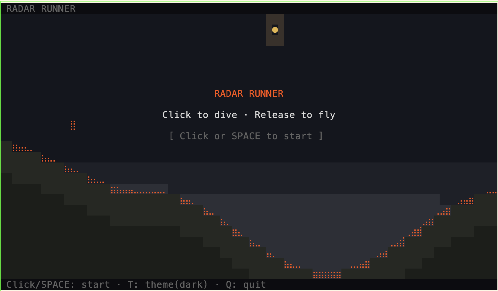

# Radar Runner

A physics-based side-scrolling game where you roll a bird over procedurally generated hills, racing against nightfall. Plays in the **browser** and the **terminal**.

**[Play in browser](https://alexbruf.github.io/radar-runner/)** | [Download TUI binary](../../releases)

Both versions share the same [Planck.js](https://github.com/piqnt/planck.js) (Box2D) physics engine, seeded terrain generation, and game mechanics.

### Terminal Version



## How to Play

You're a bird rolling over hills. **Hold** to dive heavy into downslopes to build speed. **Release** to float light off hilltops and soar. Fly as far as you can before nightfall catches you from behind.

Land 5 perfect dives in a row to trigger **Fever Mode** — a massive speed boost that rockets you into the sky.

## Quick Start

```sh
# Requires Bun — https://bun.sh
bun install

# Terminal version
bun tui.ts

# Browser version
bun dev
```

Or download a prebuilt binary from [Releases](../../releases).

## Terminal Version (TUI)

Renders with Unicode braille characters for smooth terrain at 4x vertical resolution, with dynamic camera zoom, parallax backgrounds, and dark/light themes.

### Controls

| Input | Action |
|-------|--------|
| **Click & hold** | Dive (heavy gravity) |
| **Release click** | Fly (light gravity) |
| `SPACE` / `↓` | Dive (keyboard fallback) |
| `↑` | Fly (keyboard) |
| `P` / `ESC` | Pause / Resume |
| `R` | Reset to title |
| `T` | Toggle dark / light theme |
| `Q` | Quit |

Mouse gives instant press/release. Keyboard uses a commit window to handle terminal key-repeat delay.

### Install Binary

```sh
# macOS Apple Silicon
curl -LO https://github.com/alexbruf/radar-runner/releases/latest/download/radar-runner-darwin-arm64.gz
gunzip radar-runner-darwin-arm64.gz
chmod +x radar-runner-darwin-arm64
./radar-runner-darwin-arm64

# Linux x64
curl -LO https://github.com/alexbruf/radar-runner/releases/latest/download/radar-runner-linux-x64
chmod +x radar-runner-linux-x64
./radar-runner-linux-x64
```

### TUI Features

- **Planck.js physics** — identical Box2D simulation to the browser version
- **Braille rendering** — 4x vertical, 2x horizontal sub-cell resolution
- **Dynamic camera zoom** — viewport scales with altitude, terrain always visible at bottom
- **Parallax backgrounds** — two depth layers at different scroll speeds
- **Sun, stars, night chaser** — celestial bodies dim as night approaches
- **Fading trail** — dot trail behind the bird
- **Fever mode** — screen flash, color pulse, speed boost
- **Dark / light themes** — auto-detected from terminal environment
- **Zero terminal dependencies** — raw ANSI + stdin, compiles to standalone binary

## Browser Version

React + Canvas 2D with full visual effects — glow, particles, rotation, speed arcs, smooth gradients.

**[Play now](https://alexbruf.github.io/radar-runner/)**

```sh
bun dev      # dev server at localhost:5173
bun build    # production build to dist/
```

## Game Mechanics

- **Procedural terrain** — seeded RNG (mulberry32) generates 303 valleys with increasing difficulty
- **Night chaser** — darkness approaches at 1400 px/s from behind
- **Combo system** — land on downhill slopes while diving to build combos
- **Fever mode** — 5 perfect landings triggers low-gravity speed boost
- **Dynamic camera** — zooms out at altitude for dramatic soaring visuals
- **6 color palettes** — cycle as you progress through zones

## Building

```sh
bun run build         # Browser → dist/
bun run build:tui     # TUI → standalone radar-runner binary
```

## Releasing

Push a version tag to build cross-platform binaries via GitHub Actions:

```sh
git tag v1.0.0 && git push origin v1.0.0
```

Builds: Linux x64/ARM64 (UPX compressed), macOS x64/ARM64 (gzip).

## Tech

| | Browser | Terminal |
|---|---|---|
| Renderer | Canvas 2D | Raw ANSI + Unicode braille |
| Framework | React 19 + Vite | None (zero deps beyond Planck) |
| Physics | Planck.js | Planck.js |
| Input | Mouse/touch/keyboard events | SGR mouse protocol + raw stdin |
| Build | Vite | Bun `--compile` |
| Size | ~200KB bundle | ~22MB binary (compressed) |
