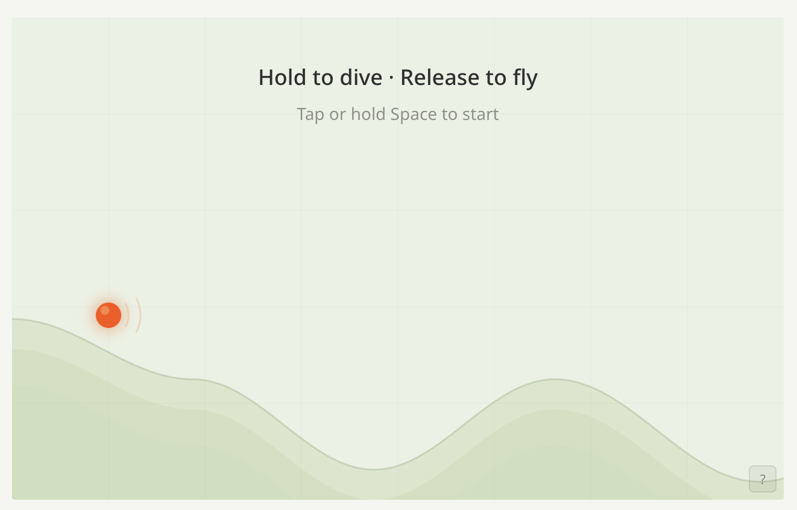

# Radar Runner

A gravity-based flight game as a **web component** — drop it into any page with zero framework dependencies.

**[Play demo](https://alexbruf.github.io/radar-runner/)** | [npm](https://www.npmjs.com/package/@alexbruf/radar-runner)



### Terminal version


## Install

```sh
bun add @alexbruf/radar-runner    # or npm install @alexbruf/radar-runner
```

Or load from a CDN:

```html
<script type="module" src="https://cdn.jsdelivr.net/npm/@alexbruf/radar-runner/dist/radar-runner.js"></script>
```

## Usage

```html
<!-- That's it -->
<radar-runner></radar-runner>
```

### Sizing

```html
<radar-runner width="800"></radar-runner>   <!-- explicit width, height auto (8:5 ratio) -->
<radar-runner height="300"></radar-runner>  <!-- explicit height, width auto -->
<radar-runner></radar-runner>              <!-- fills container, max 640px -->
```

### Theme

Follows `prefers-color-scheme` by default. Override with `color-mode`:

```html
<radar-runner color-mode="dark"></radar-runner>
<radar-runner color-mode="light"></radar-runner>
```

### Collapsed / accordion mode

Starts as a button. Game loads on first click — zero bytes downloaded until the user engages.

```html
<radar-runner collapsed></radar-runner>
```

Customize the open/close button content with named slots:

```html
<radar-runner collapsed>
  <span slot="open">Play a game</span>
  <span slot="close">Hide game</span>
</radar-runner>
```

Put whatever you want in the slots — SVGs, images, styled text:

```html
<radar-runner collapsed>
  <span slot="open">
    <svg width="18" height="18" viewBox="0 0 24 24"><path d="M5 3l14 9-14 9V3z" fill="currentColor"/></svg>
    Play while you wait
  </span>
  <span slot="close">Close</span>
</radar-runner>
```

Default fallbacks are provided if no slots are used.

### Styling the toggle button

CSS custom properties:

```css
radar-runner {
  --rr-toggle-bg: #1a1a2e;
  --rr-toggle-color: #e94560;
  --rr-toggle-border: 1px solid #e94560;
  --rr-toggle-font: 600 16px Inter, sans-serif;
  --rr-toggle-radius: 12px;
  --rr-toggle-padding: 12px 32px;
}
```

Or use `::part(toggle)` for full CSS access:

```css
radar-runner::part(toggle) {
  box-shadow: 0 2px 8px rgba(0,0,0,0.2);
}
```

### Styling the in-game buttons

```css
radar-runner {
  --rr-btn-padding: 8px;
  --rr-btn-radius: 8px;
  --rr-btn-icon-size: 22;
}
```

Or via `::part()`:

```css
radar-runner::part(btn-help),
radar-runner::part(btn-pause),
radar-runner::part(btn-reset) {
  padding: 8px;
}
```

## Framework wrappers

### React

```tsx
import { RadarRunner } from '@alexbruf/radar-runner/react';

<RadarRunner width={640} colorMode="dark" collapsed>
  <span slot="open">Play!</span>
</RadarRunner>
```

### Preact

```tsx
import { RadarRunner } from '@alexbruf/radar-runner/preact';

<RadarRunner width={640} collapsed />
```

### Vue

```vue
<script setup>
import { RadarRunner } from '@alexbruf/radar-runner/vue';
</script>

<template>
  <RadarRunner :width="640" :collapsed="true">
    <template #open>Play!</template>
    <template #close>Hide</template>
  </RadarRunner>
</template>
```

## How to play

**Hold** (click, tap, or Space) to dive heavy into slopes. **Release** to float light and soar off hilltops. Fly as far as you can before nightfall catches you.

Land 5 perfect dives in a row to trigger **Fever Mode**.

## Architecture

The package ships as two chunks:

| File | Size (gzip) | Contents |
|------|------------|----------|
| `radar-runner.js` | ~3 KB | Web component shell, loading screen, theme, sizing |
| `radar-runner-game.js` | ~55 KB | Planck.js physics engine + game logic (lazy-loaded) |

The game chunk only loads when the component is visible (or on first expand in collapsed mode). Framework wrappers are <1 KB each.

## Terminal version (TUI)

There's also a standalone terminal version using Unicode braille rendering. See [Releases](../../releases) for prebuilt binaries, or run from source:

```sh
bun tui.ts
```

## Development

```sh
bun install
bun dev           # demo site at localhost:5173
bun run build     # library → dist/
bun run build:demo # demo site → demo-dist/
bun run typecheck  # type checking
```

## License

MIT
